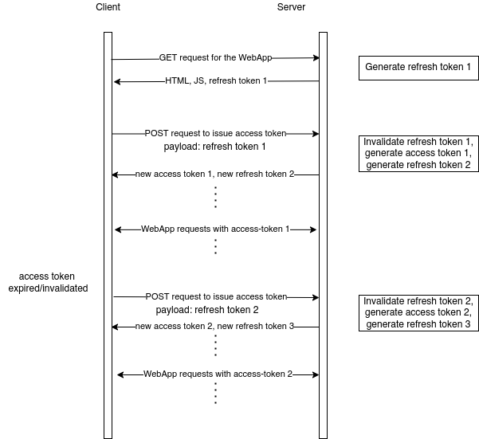
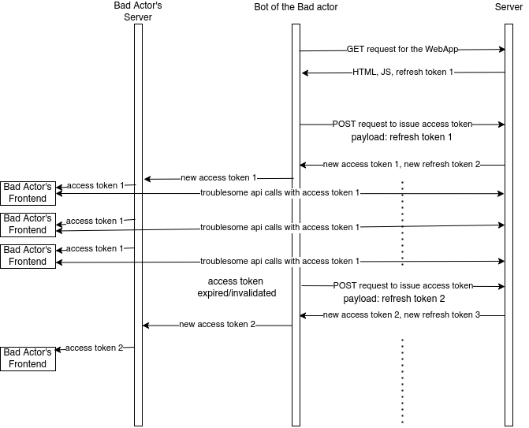
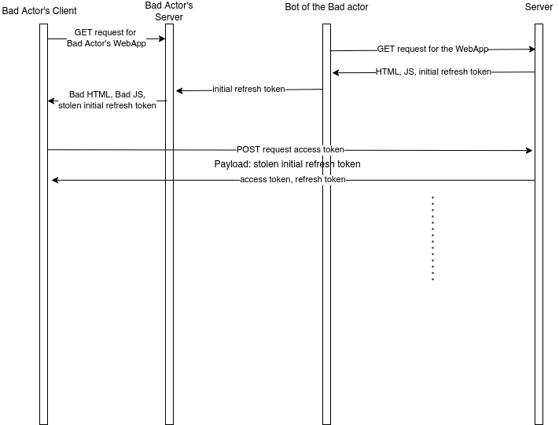

# Securing APIs for a Public WebApp

## Challenges of a Public WebApp:
To tackle this first we need to understand the challenges of public WebApp:
1. Users of the site don't need to log in, and as such **we cannot associate a login authentication token/session/credentials with a particular user** to use with our REST APIs.
2. The WebApp should be running on HTTPS. This way we can assume that we are protected against a bad actor snooping and trying to collect sensitive information and **the channel between our server and the user's browser are secure**.
3. However, if a bad actor accesses our site, then he/she can get hold of all access token/credentials and use those in his/her web app. Assume that minimized and obscurificated HTML and JavaScript does not help. Also assume that he/she has full access to cookie, localStorage, sessionStorage and indexedDB in the client browser. **Once an access token is delivered to our public WebApp, it can be abused by the bad actor.**
4. The bad actor might as well **implement a bot which steals the access token form our public site** at every interval and use it in his/her web app.
5. Encoding the token as **JWT token with a secret might not help, since the secret is compromised** as the bad actor has full access to the code and resources in the client side.

## Access Token
Firstly, our REST API needs to be secured by an **access token** to avoid unauthorized access. However, due to challenges 3,4,5 mention above we have to take extra precautions. The access token must be short-lived, that is it should have a short expiry time.  This way even if an access token is compromised, the bad actor will not have the liberty to use it forever. 

### Access Token Database Model
Let us design the access token model in the server.

```
id:                 access token id
issued_at:          timestamp the access token was issued
expires_at:         timestamp of the access token expiry 
secret:             secret key of the JWT access token
access_token:       JWT token with payload (id, issued_at, expires_at) encoded with secret.
access_rate:        The number of times this token is used per time slot.
```

We will use the `access_rate` to rate limit access to a particular access token. The time slot can be implemented as business logic such that at the start of the time slot, access_rate for all tokens go back to 0. To make the database manageable, we will delete all expired access token periodically. If we are using Django, we can use Django management command triggered periodically.

### Issuing Access Token
The access token will expire, but our real users should be able to use the public website smoothly without the APIs blocking. The users will think our website is buggy and will stop using it! For that we need another token called **refresh token**. And we have to issue another access token by using the refresh token by requesting to the server. We can have a **URL endpoint which issues access token if the refresh token is valid**. 

## Refresh Token
Refresh tokens can be used by our WebApp to issue access tokens. But if the bad actor gets hold of one of our refresh token, it will make our access token security useless! If the bad actors' WebApp is getting popular day by day on expense of our APIs, then he/she may well steal our refresh token due to challenge 3 mentioned above.

To avoid that, we will make refresh token single use. Once the refresh token is used, it becomes invalidated. We could add expiry time as well, but single use might just be enough.

### Refresh Token Database Model
We don't require much information to be stored for the refresh token. It could be JWT token with refresh_token id encoded with a random secret. Each refresh token has to be unique. 

```
id:                 refresh token id
refresh_token:      JWT token with payload (refresh_token_id) encoded with secret.
secret:             secret used to encode the JWT refresh token
used:               boolean true or false
```

To save space on database, we might as well delete used refresh token periodically. 
To verify refresh token, **the server matches the `refresh_token`, decodes it using `secret`, matches `id` and then checks if it has already been `used` or not**.

### Issuing Refresh Token
The initial refresh token can be embedded in the HTML or JavaScipt of our WebApp. That is **a user loading our web page should be the only access point to get the initial refresh token**. There should not be any other endpoints to generate an initial refresh token. The successive refresh token can be issued along with the access token and passed to the frontend.

## Combining both Tokens
With the refresh token and access token together we have got pretty tight security now. It has become harder for the bad actor to keep his/her WebApp running now. 



We could also send the access token secret while issuing access token. After issuing a new access token, the client would get (new access token, new refresh token, secret of the new access token). This was the client could check the expiry time and issue new access token before it expires. If we don't send the secret, then an **Unauthorized Access should trigger a new access token request in the client**.

The bad actor has some problems now:
* It is not possible to get multiple access token with the same refresh token. **One refresh token generates one access token**.
* The only way to get a new initial refresh token is to request the WebApp again.
* The **access token expires**. 

However, a resourceful bad actor may:
1. Implement a bot that keep on generating access tokens in the background then distribute the same access token to all his users.
2. Implement a bot that loads our webpage each time a user visits his page and steals our initial refresh token for his user.

## Rate Limiting Access Tokens

The bad actor's may develop the strategy to distribute the same access token to his clients to circumvent our security. 




This is where our `access_rate` in the access token model is useful. We can **rate limit the calls to our API based on the access token used**. The rate limit threshold can be set to deter bad actor's frontend. If his/her WebApp gains popularity, the users of the bad actor's website will be frustrated and complain how poorly the WebApp is designed. :D

## reCAPTCHA

The bad actor could steal our initial refresh token by loading our WebApp in the backend and then steal the initial refresh token for each client he gets.




But here we see that its being stolen by a bot. We could integrate reCAPTCHA service like Google reCAPTCHA 3, before the WebApp is loaded in the frontend and the backend. Since the bot will not be able to solve the captcha, they cannot steal our initial refresh token.

## Conclusion

A combination of one time use refresh token, short-lived access token, rate limiting based on access token and reCAPTCHA would help us in securing our APIs to some degree. The APIs should be running over HTTPs.

The steps mentioned above would make it very difficult for the bad actor to run scale and run their WebApp smoothly. But since the nature of our WebApp is public, it would be hard to stop them right in their tracks.